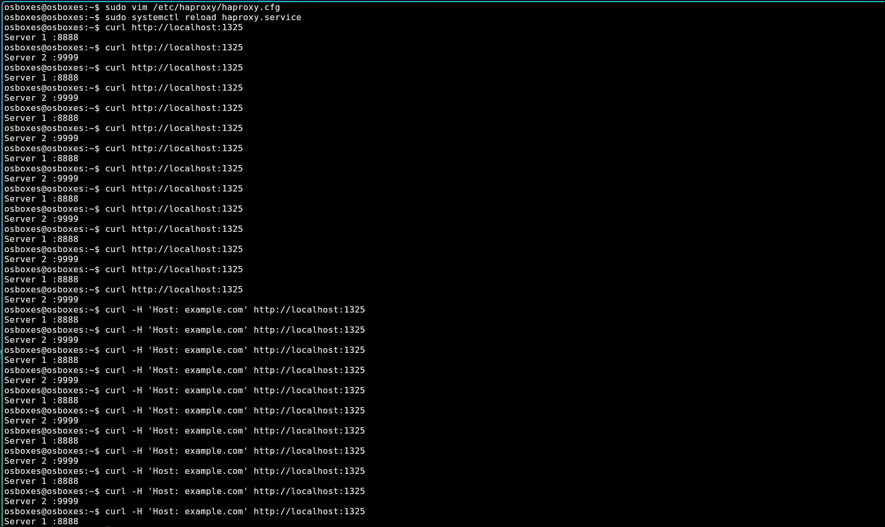
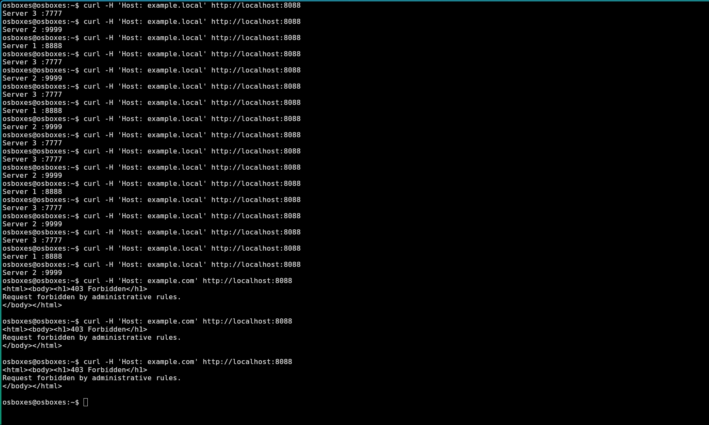

# Домашнее задание к занятию "Кластеризация и балансировка нагрузки" - Валик Александр

### Задание 1

1. Запущены два simple python сервера на виртуальной машине на разных портах.

2. Установлен и настроен HAProxy. (haproxy.cfg)

3. Настроена балансировка Round-robin на 4 уровне.

 ---

### Задание 2

1. Запущены три simple python сервера на виртуальной машине на разных портах.

2. Настройте балансировку Weighted Round Robin на 7 уровне, чтобы первый сервер имел вес 2, второй - 3, а третий - 4. (haproxy_2.cfg)

3. HAproxy балансирует только тот http-трафик, который адресован домену example.local.

